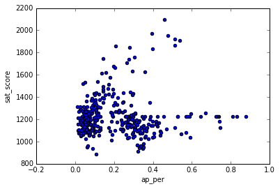

# Guided Project: Analyzing NYC High School Data

Over the last three missions, we explored relationships between SAT scores and demographic factors in New York City public schools. For a brief bit of background, the SAT, or Scholastic Aptitude Test, is a test that high school seniors in the U.S. take every year. The SAT has three sections, each of which is worth a maximum of 800 points. Colleges use the SAT to determine which students to admit. High average SAT scores are usually indicative of a good school.

New York City has published data on student SAT scores by high school, along with additional demographic data sets. Over the last three missions, we combined the following data sets into a single, clean pandas dataframe:

* SAT scores by school - SAT scores for each high school in New York City
* School attendance - Attendance information for each school in New York City
* Class size - Information on class size for each school
* AP test results - Advanced Placement (AP) exam results for each high school (passing an optional AP exam in a particular subject can earn a student college credit in that subject)
* Graduation outcomes - The percentage of students who graduated, and other outcome information
* Demographics - Demographic information for each school
* School survey - Surveys of parents, teachers, and students at each school
New York City has a significant immigrant population and is very diverse, so comparing demographic factors such as race, income, and gender with SAT scores is a good way to determine whether the SAT is a fair test. For example, if certain racial groups consistently perform better on the SAT, we would have some evidence that the SAT is unfair.

In the last mission, we began performing some analysis. We'll extend that analysis in this mission. As you can see, we've included the code to read in all of the data, combine it, and create correlations in the notebook. If you'd like to see the finished notebook that contains solutions for all of the steps, you can find it in the GitHub repo for this mission.

The dataframe combined contains all of the data we'll be using in our analysis.

# Read in the data


```python
import pandas as pd
import numpy
import re

data_files = [
    "ap_2010.csv",
    "class_size.csv",
    "demographics.csv",
    "graduation.csv",
    "hs_directory.csv",
    "sat_results.csv"
]

data = {}

for f in data_files:
    d = pd.read_csv("schools/{0}".format(f))
    data[f.replace(".csv", "")] = d
```

# Read in the surveys


```python
all_survey = pd.read_csv("schools/survey_all.txt", delimiter="\t", encoding='windows-1252')
d75_survey = pd.read_csv("schools/survey_d75.txt", delimiter="\t", encoding='windows-1252')
survey = pd.concat([all_survey, d75_survey], axis=0)

survey["DBN"] = survey["dbn"]

survey_fields = [
    "DBN", 
    "rr_s", 
    "rr_t", 
    "rr_p", 
    "N_s", 
    "N_t", 
    "N_p", 
    "saf_p_11", 
    "com_p_11", 
    "eng_p_11", 
    "aca_p_11", 
    "saf_t_11", 
    "com_t_11", 
    "eng_t_11", 
    "aca_t_11", 
    "saf_s_11", 
    "com_s_11", 
    "eng_s_11", 
    "aca_s_11", 
    "saf_tot_11", 
    "com_tot_11", 
    "eng_tot_11", 
    "aca_tot_11",
]
survey = survey.loc[:,survey_fields]
data["survey"] = survey
```

# Add DBN columns


```python
data["hs_directory"]["DBN"] = data["hs_directory"]["dbn"]

def pad_csd(num):
    string_representation = str(num)
    if len(string_representation) > 1:
        return string_representation
    else:
        return "0" + string_representation
    
data["class_size"]["padded_csd"] = data["class_size"]["CSD"].apply(pad_csd)
data["class_size"]["DBN"] = data["class_size"]["padded_csd"] + data["class_size"]["SCHOOL CODE"]
```

# Convert columns to numeric


```python
cols = ['SAT Math Avg. Score', 'SAT Critical Reading Avg. Score', 'SAT Writing Avg. Score']
for c in cols:
    data["sat_results"][c] = pd.to_numeric(data["sat_results"][c], errors="coerce")

data['sat_results']['sat_score'] = data['sat_results'][cols[0]] + data['sat_results'][cols[1]] + data['sat_results'][cols[2]]

def find_lat(loc):
    coords = re.findall("\(.+, .+\)", loc)
    lat = coords[0].split(",")[0].replace("(", "")
    return lat

def find_lon(loc):
    coords = re.findall("\(.+, .+\)", loc)
    lon = coords[0].split(",")[1].replace(")", "").strip()
    return lon

data["hs_directory"]["lat"] = data["hs_directory"]["Location 1"].apply(find_lat)
data["hs_directory"]["lon"] = data["hs_directory"]["Location 1"].apply(find_lon)

data["hs_directory"]["lat"] = pd.to_numeric(data["hs_directory"]["lat"], errors="coerce")
data["hs_directory"]["lon"] = pd.to_numeric(data["hs_directory"]["lon"], errors="coerce")
```

# Condense datasets


```python
class_size = data["class_size"]
class_size = class_size[class_size["GRADE "] == "09-12"]
class_size = class_size[class_size["PROGRAM TYPE"] == "GEN ED"]

class_size = class_size.groupby("DBN").agg(numpy.mean)
class_size.reset_index(inplace=True)
data["class_size"] = class_size

data["demographics"] = data["demographics"][data["demographics"]["schoolyear"] == 20112012]

data["graduation"] = data["graduation"][data["graduation"]["Cohort"] == "2006"]
data["graduation"] = data["graduation"][data["graduation"]["Demographic"] == "Total Cohort"]
```

# Convert AP scores to numeric


```python
cols = ['AP Test Takers ', 'Total Exams Taken', 'Number of Exams with scores 3 4 or 5']

for col in cols:
    data["ap_2010"][col] = pd.to_numeric(data["ap_2010"][col], errors="coerce")
```

# Combine the datasets


```python
combined = data["sat_results"]

combined = combined.merge(data["ap_2010"], on="DBN", how="left")
combined = combined.merge(data["graduation"], on="DBN", how="left")

to_merge = ["class_size", "demographics", "survey", "hs_directory"]

for m in to_merge:
    combined = combined.merge(data[m], on="DBN", how="inner")

combined = combined.fillna(combined.mean())
combined = combined.fillna(0)
```

# Add a school district column for mapping


```python
def get_first_two_chars(dbn):
    return dbn[0:2]

combined["school_dist"] = combined["DBN"].apply(get_first_two_chars)
```

# Find correlations


```python
correlations = combined.corr()
correlations = correlations["sat_score"]
print(correlations)
```

    SAT Critical Reading Avg. Score         0.986820
    SAT Math Avg. Score                     0.972643
    SAT Writing Avg. Score                  0.987771
    sat_score                               1.000000
    AP Test Takers                          0.523140
    Total Exams Taken                       0.514333
    Number of Exams with scores 3 4 or 5    0.463245
    Total Cohort                            0.325144
    CSD                                     0.042948
    NUMBER OF STUDENTS / SEATS FILLED       0.394626
    NUMBER OF SECTIONS                      0.362673
    AVERAGE CLASS SIZE                      0.381014
    SIZE OF SMALLEST CLASS                  0.249949
    SIZE OF LARGEST CLASS                   0.314434
    SCHOOLWIDE PUPIL-TEACHER RATIO               NaN
    schoolyear                                   NaN
    fl_percent                                   NaN
    frl_percent                            -0.722225
    total_enrollment                        0.367857
    ell_num                                -0.153778
    ell_percent                            -0.398750
    sped_num                                0.034933
    sped_percent                           -0.448170
    asian_num                               0.475445
    asian_per                               0.570730
    black_num                               0.027979
    black_per                              -0.284139
    hispanic_num                            0.025744
    hispanic_per                           -0.396985
    white_num                               0.449559
                                              ...   
    rr_p                                    0.047925
    N_s                                     0.423463
    N_t                                     0.291463
    N_p                                     0.421530
    saf_p_11                                0.122913
    com_p_11                               -0.115073
    eng_p_11                                0.020254
    aca_p_11                                0.035155
    saf_t_11                                0.313810
    com_t_11                                0.082419
    eng_t_11                                0.036906
    aca_t_11                                0.132348
    saf_s_11                                0.337639
    com_s_11                                0.187370
    eng_s_11                                0.213822
    aca_s_11                                0.339435
    saf_tot_11                              0.318753
    com_tot_11                              0.077310
    eng_tot_11                              0.100102
    aca_tot_11                              0.190966
    grade_span_max                               NaN
    expgrade_span_max                            NaN
    zip                                    -0.063977
    total_students                          0.407827
    number_programs                         0.117012
    priority08                                   NaN
    priority09                                   NaN
    priority10                                   NaN
    lat                                    -0.121029
    lon                                    -0.132222
    Name: sat_score, Length: 67, dtype: float64


# Plotting survey correlations


```python
# Remove DBN since it's a unique identifier, not a useful numerical value for correlation.
survey_fields.remove("DBN")
```


```python
%matplotlib inline
combined.corr()["sat_score"][survey_fields].plot.bar()
```


    <matplotlib.axes._subplots.AxesSubplot at 0x7fb2e224a7b8>


There are high correlations between N_s, N_t, N_p and sat_score. Since these columns are correlated with total_enrollment, it makes sense that they would be high.

It is more interesting that rr_s, the student response rate, or the percentage of students that completed the survey, correlates with sat_score. This might make sense because students who are more likely to fill out surveys may be more likely to also be doing well academically.

How students and teachers percieved safety (saf_t_11 and saf_s_11) correlate with sat_score. This make sense, as it's hard to teach or learn in an unsafe environment.

The last interesting correlation is the aca_s_11, which indicates how the student perceives academic standards, correlates with sat_score, but this is not true for aca_t_11, how teachers perceive academic standards, or aca_p_11, how parents perceive academic standards.

# Exploring safety


```python
combined.plot.scatter("saf_s_11", "sat_score")
```


    <matplotlib.axes._subplots.AxesSubplot at 0x7fb2e2234e48>


There appears to be a correlation between SAT scores and safety, although it isn't thatstrong. It looks like there are a few schools with extremely high SAT scores and high safety scores. There are a few schools with low safety scores and low SAT scores. No school with a safety score lower than 6.5 has an average SAT score higher than 1500 or so.

# Plotting safety


```python
import matplotlib.pyplot as plt
from mpl_toolkits.basemap import Basemap

districts = combined.groupby("school_dist").agg(numpy.mean)
districts.reset_index(inplace=True)

m = Basemap(
    projection='merc', 
    llcrnrlat=40.496044, 
    urcrnrlat=40.915256, 
    llcrnrlon=-74.255735, 
    urcrnrlon=-73.700272,
    resolution='i'
)

m.drawmapboundary(fill_color='#85A6D9')
m.drawcoastlines(color='#6D5F47', linewidth=.4)
m.drawrivers(color='#6D5F47', linewidth=.4)
# Temporary bug: if you run the following line of code in the Jupyter Guided Project interface on Dataquest, you'll get an error. 
# We're working on a fix, thanks for your patience! This should work fine locally on your own computer though.
m.fillcontinents(color='white',lake_color='#85A6D9')

longitudes = districts["lon"].tolist()
latitudes = districts["lat"].tolist()
m.scatter(longitudes, latitudes, s=50, zorder=2, latlon=True, c=districts["saf_s_11"], cmap="summer")
plt.show()
```


It looks like Upper Manhattan and parts of Queens and the Bronx tend to have higher safety scores, whereas Brooklyn has low safety scores.

# Racial differences in SAT scores


```python
race_fields = ["white_per", "asian_per", "black_per", "hispanic_per"]
combined.corr()["sat_score"][race_fields].plot.bar()
```


    <matplotlib.axes._subplots.AxesSubplot at 0x7fb2e2175a58>


It looks like a higher percentage of white or asian students at a school correlates positively with sat score, whereas a higher percentage of black or hispanic students correlates negatively with sat score. This may be due to a lack of funding for schools in certain areas, which are more likely to have a higher percentage of black or hispanic students.


```python
combined.plot.scatter("hispanic_per", "sat_score")
```


    <matplotlib.axes._subplots.AxesSubplot at 0x7fb2e018b320>


```python
print(combined[combined["hispanic_per"] > 95]["SCHOOL NAME"])
```

    44                         MANHATTAN BRIDGES HIGH SCHOOL
    82      WASHINGTON HEIGHTS EXPEDITIONARY LEARNING SCHOOL
    89     GREGORIO LUPERON HIGH SCHOOL FOR SCIENCE AND M...
    125                  ACADEMY FOR LANGUAGE AND TECHNOLOGY
    141                INTERNATIONAL SCHOOL FOR LIBERAL ARTS
    176     PAN AMERICAN INTERNATIONAL HIGH SCHOOL AT MONROE
    253                            MULTICULTURAL HIGH SCHOOL
    286               PAN AMERICAN INTERNATIONAL HIGH SCHOOL
    Name: SCHOOL NAME, dtype: object


The schools listed above appear to primarily be geared towards recent immigrants to the US. These schools have a lot of students who are learning English, which would explain the lower SAT scores.


```python
print(combined[(combined["hispanic_per"] < 10) & (combined["sat_score"] > 1800)]["SCHOOL NAME"])
```

    37                                STUYVESANT HIGH SCHOOL
    151                         BRONX HIGH SCHOOL OF SCIENCE
    187                       BROOKLYN TECHNICAL HIGH SCHOOL
    327    QUEENS HIGH SCHOOL FOR THE SCIENCES AT YORK CO...
    356                  STATEN ISLAND TECHNICAL HIGH SCHOOL
    Name: SCHOOL NAME, dtype: object


Many of the schools above appear to be specialized science and technology schools that receive extra funding, and only admit students who pass an entrance exam. This doesn't explain the low hispanic_per, but it does explain why their students tend to do better on the SAT -- they are students from all over New York City who did well on a standardized test.

# Gender differences in SAT scores


```python
gender_fields = ["male_per", "female_per"]
combined.corr()["sat_score"][gender_fields].plot.bar()
```


    <matplotlib.axes._subplots.AxesSubplot at 0x7fb2e018b5c0>


In the plot above, we can see that a high percentage of females at a school positively correlates with SAT score, whereas a high percentage of males at a school negatively correlates with SAT score. Neither correlation is extremely strong.


```python
combined.plot.scatter("female_per", "sat_score")
```


    <matplotlib.axes._subplots.AxesSubplot at 0x7fb2e00d7400>


Based on the scatterplot, there doesn't seem to be any real correlation between sat_score and female_per. However, there is a cluster of schools with a high percentage of females (60 to 80), and high SAT scores.


```python
print(combined[(combined["female_per"] > 60) & (combined["sat_score"] > 1700)]["SCHOOL NAME"])
```

    5                         BARD HIGH SCHOOL EARLY COLLEGE
    26                         ELEANOR ROOSEVELT HIGH SCHOOL
    60                                    BEACON HIGH SCHOOL
    61     FIORELLO H. LAGUARDIA HIGH SCHOOL OF MUSIC & A...
    302                          TOWNSEND HARRIS HIGH SCHOOL
    Name: SCHOOL NAME, dtype: object


These schools appears to be very selective liberal arts schools that have high academic standards.

# AP Exam Scores vs SAT Scores


```python
combined["ap_per"] = combined["AP Test Takers "] / combined["total_enrollment"]

combined.plot.scatter(x='ap_per', y='sat_score')
```


    <matplotlib.axes._subplots.AxesSubplot at 0x7fb2e19f6320>





It looks like there is a relationship between the percentage of students in a school who take the AP exam, and their average SAT scores. It's not an extremely strong correlation, though.


```python

```
